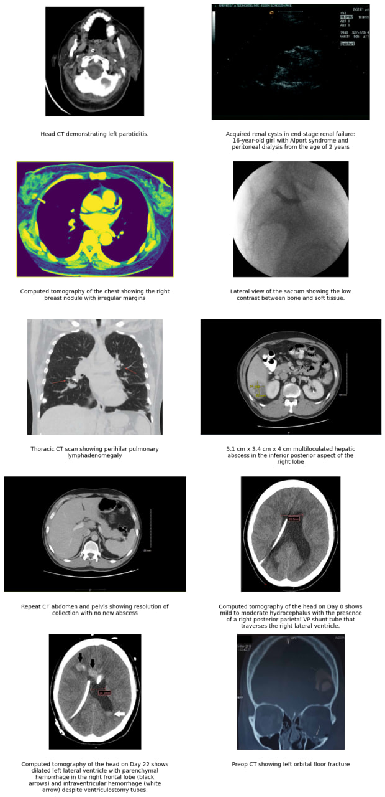

# Radiology Image Captioning  
In this project the multimedia dataset ROCOv2, which includes radiology images along with related medical concepts and captions, was examined. This dataset, extracted from the open-access subset of PubMed, contains seven different clinical modalities, and its concepts were manually collected and evaluated by a radiology specialist.
Next, the pre-trained ViTMAE model from the Transformer library was loaded, and its performance in reconstructing images from the Test set with 75% masking was evaluated. Then, this model was fine-tuned on the Train data specific to the medical imaging domain, and the reconstruction of Test image samples after retraining was examined.
In the third section, using the LoRA method and the PEFT library, a multimodal model was built and fine-tuned to generate captions for medical images from the ROCOv2 dataset. The final model’s performance was assessed using standard image captioning metrics such as CIDEr, BLEU, METEOR, and ROUGE. The results demonstrated the capability of these models in analyzing and reconstructing images as well as generating relevant medical captions.

  

